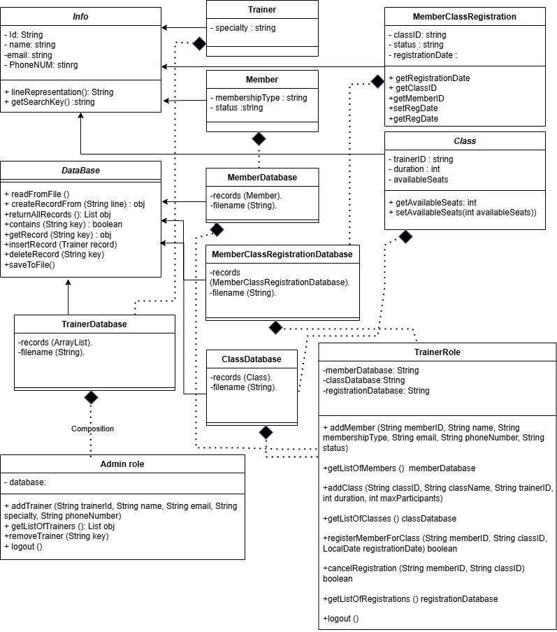

# Gym Membership Management System


**Gym Membership Management System** is a desktop application built using **Java** and **Java Swing**. It allows gym administrators and trainers to manage members, trainers, classes, and registrations efficiently. The system supports features like adding/removing trainers and members, managing classes, registering members for classes, and handling cancellations. This project was developed as part of the **Programming II** course at Alexandria University, Faculty of Engineering.

---

## Table of Contents
1. [Introduction](#introduction)
2. [Features](#features)
3. [Technologies Used](#technologies-used)
4. [Installation](#installation)
5. [Screenshots](#screenshots)
6. [UML Diagrams](#uml-diagrams)
7. [Usage](#usage)
8. [Additional Features](#additional-features)
9. [File Handling](#file-handling)
10. [Validation](#validation)
11. [License](#license)
12. [Contact](#contact)

---

## Introduction
The **Gym Membership Management System** is designed to streamline gym operations by providing an intuitive interface for admins and trainers to manage:
- **Trainers**: Add, remove, and view trainers.
- **Members**: Add, remove, and view members.
- **Classes**: Add, view, and manage class registrations.
- **Registrations**: Register members for classes, cancel registrations, and view all registrations.

The system is built in two phases:
1. **Phase 1**: Core backend functionality (Lab 4).
2. **Phase 2**: GUI implementation using Java Swing (Lab 5).

---

## Features
### Core Features:
- **Admin Role**:
  - Add, remove, and view trainers.
  - Logout with data saving.
- **Trainer Role**:
  - Add, remove, and view members.
  - Add, view, and manage classes.
  - Register members for classes and cancel registrations.
  - Logout with data saving.

### Additional Features (Beyond PDF Requirements):
- **Input Validation**:
  - Ensure all fields are filled before adding trainers, members, or classes.
  - Validate unique IDs for trainers and members.
  - Check for available seats before registering members for classes.
- **Error Handling**:
  - Display error messages for invalid inputs (e.g., empty fields, duplicate IDs, full classes).
- **Data Persistence**:
  - All data (trainers, members, classes, registrations) is saved to and loaded from text files (`Trainers.txt`, `Members.txt`, `Class.txt`, `Registration.txt`).

---

## Technologies Used
- **Java**: Core programming language.
- **Java Swing**: For building the graphical user interface (GUI).
- **Java AWT**: For basic rendering and event handling.
- **Object-Oriented Programming (OOP)**: Inheritance, polymorphism, and encapsulation.
- **File Handling**: Reading from and writing to text files for data persistence.

---

## Installation
To run the **Gym Membership Management System** locally, follow these steps:

1. **Clone the repository**:
   ```bash
   git clone https://github.com/Abdo-Anwar/Gym_system_GUI_java.git
2. **Navigate to the project directory:**:
   ```bash
   cd cd gym-management-system
3. **Compile the project:**
   ```bash
   javac -d bin src/*.java
5. **Run the application:**
   ```bash
   java -cp bin Main

## Screenshots/GIFs
Here are some screenshots and GIFs demonstrating the functionality of the **Mini Paint App:**


- **Main application window:**

  

- **Admin Login::**
  

- **Admin Role Window**
  
  

- **Trainer Role Window**
  

- **Add Member Window**
  

- **View Classes Window:**

   

- **table:** 
  

----------------------------------------------------------------
## UML Diagram
**UML class Digrame**


## Usage
### Admin Role:
1. **Login**:
   - Enter the admin credentials (`admin`, `12345`).
2. **Add Trainer**:
   - Fill in the trainer's details (ID, name, email, specialty, phone number).
3. **View Trainers**:
   - View all trainers in a table format.
4. **Remove Trainer**:
   - Enter the trainer's ID to remove them from the system.
5. **Logout**:
   - Save all data and return to the main window.

### Trainer Role:
1. **Login**:
   - Enter the trainer credentials (`trainer`, `56789`).
2. **Add Member**:
   - Fill in the member's details (ID, name, email, membership type, phone number, status).
3. **View Members**:
   - View all members in a table format.
4. **Add Class**:
   - Fill in the class details (ID, name, trainer ID, duration, max participants).
5. **Register Member for Class**:
   - Register a member for a class if seats are available.
6. **Cancel Registration**:
   - Cancel a member's registration for a class.
7. **Logout**:
   - Save all data and return to the main window.

---

## Additional Features
### Input Validation:
- **Trainer/Member Addition**:
  - Ensure all fields are filled.
  - Validate unique IDs.
- **Class Registration**:
  - Check for available seats before registration.
- **Login**:
  - Validate admin and trainer credentials.

### Error Handling:
- Display error messages for:
  - Empty fields.
  - Duplicate IDs.
  - Full classes.
  - Invalid login credentials.

---

## File Handling
All data is saved to and loaded from the following files:
- **Trainers.txt**: Stores trainer data.
- **Members.txt**: Stores member data.
- **Class.txt**: Stores class data.
- **Registration.txt**: Stores registration data.

---

## Validation
The system implements the following validations:
1. **Unique IDs**:
   - Trainer and member IDs must be unique.
2. **Field Completion**:
   - All fields must be filled before adding trainers, members, or classes.
3. **Class Seats**:
   - Members can only register for classes with available seats.
4. **Login Credentials**:
   - Admin and trainer logins require valid credentials.

---

## License
This project is licensed under the **MIT License**. See the [LICENSE](LICENSE) file for details.

---

## Contact
For questions, feedback, or collaboration, feel free to reach out:

- **Email**: [abd.ahm.anwar@gmail.com](mailto:abd.ahm.anwar@gmail.com)
- **GitHub**: [Abdo-Anwar](https://github.com/Abdo-Anwar)
- **LinkedIn**: [abdelrhman-anwar](https://www.linkedin.com/in/abdelrhman-anwar)

---
